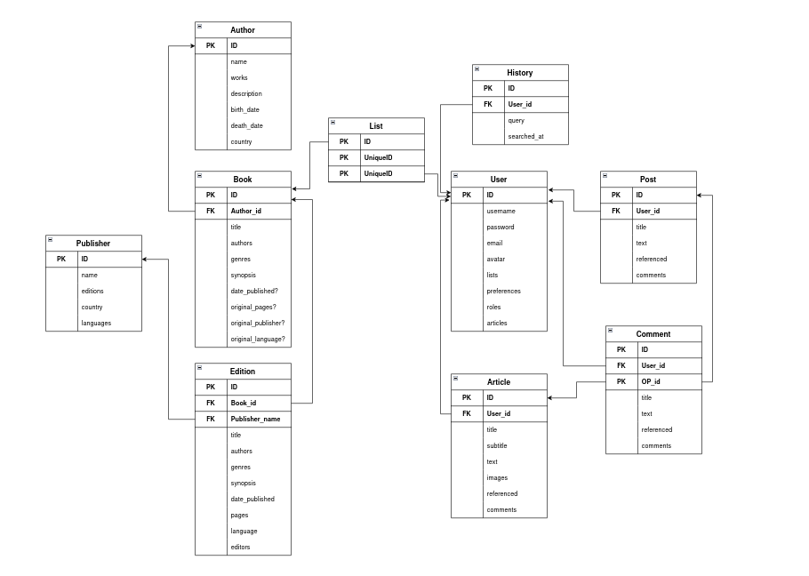

# NEWREADS: ANTEPROYECTO 

## Índice

1. [IDENTIFICACIÓN](#id1)
2. [OBJETIVOS](#id2)
3. [PREANÁLISIS DE LO EXISTENTE](#id3)
4. [PRE-ANÁLISIS DEL SISTEMA](#id4)
5. [PRE-DISEÑO DEL SISTEMA](#id5)
6. [ESTIMACIÓN DE COSTES](#id6)

### 1. IDENTIFICACIÓN 

+ Nombre del proyecto: NewReads
+ Alumnos: Jaime León García
+ Curso: 2024/2025 2º DAW
+ Tutor: David Jorge Bilbao

### 2. OBJETIVOS 

NewReads busca ser una plataforma donde los usuarios puedan buscar, listar y escribir sobre libros con otros lectores en foros de discusión con el objetivo de compartir y enriquecer sus lecturas al mismo tiempo de tener una aplicación comoda para buscar y explorar nuevos libros y autores.

### 3. PREANÁLISIS DE LO EXISTENTE 

Aunque ya existen distintas webs que sirven de bases de datos de libros, estas tienen un objetivo más concreto, por ejemplo en el caso de Goodreads, una de las más populares, ahora forma parte de Amazon y sirve como catálogo para comprar libros a través de su plataforma, por lo que su función es principalmente de buscador y la interfaz de la página no se actualiza con regularidad.

De la misma manera existen multitud de foros donde se discuten variedad de temas, entre ellos literatura a su vez que portales de artículos personales y grupales, en algunos incluso otros usuarios no asociados pueden comentar.

Algunas de estas bases de datos también dan la opción de recomendar libros a contactos y puntuar los mismos.

El objetivo de NewReads es ofrecer un portal donde los usuarios tengan acceso a todas estas opciones de manera interconectada y unificada, con el objetivo de crear una comunidad donde los usuarios puedan compartir sus gustos en forma de listas y artículos y debatir con otros usuarios sobre libros y literatura en general.

### 4. PRE-ANÁLISIS DEL SISTEMA 

El proyecto constará de las siguientes partes:  

- Motor de búsqueda de libros: Capaz de integrar resultados de bases de datos externas como Open Library y almacenar información relevante en la base de datos local para mejorar la velocidad de búsqueda.

- Gestión de listas: Permite a los usuarios guardar libros en listas personalizadas que podrán ser públicas o privadas.

- Sistema de discusión: Proporciona a los usuarios herramientas para crear discusiones sobre libros a modo de foro, con soporte para hilos de comentarios.

- Sistema de usuarios: Gestiona el registro, inicio de sesión, perfiles personalizados y roles de usuarios con permisos específicos.

Una vez cumplidos estos requisitos se plantea ampliar el proyecto con las siguientes funcionalidades

- Un sistema de publicaciones más complejas al estilo de artículos para usuarios con permisos

- Más herramientas de distribución como guardado de listas y artículos ajenos y publicaciones de estos en la página de inicio

Tecnologías a utilizar:

### 5. PRE-DISEÑO DEL SISTEMA 

- **Backend**: 
    - Django como framework para el backend

    - Django REST Framework para la API.

    - MySQL como base de datos relacional.

    - Redis para el almacenamiento en caché.

    - Djangorestframework-simplejwt para autenticación basada en tokens JWT.

- **Frontend**:
    - Vue.js con typescript como framework para el frontend

- **Despliegue**:
    - Para el backend una vps de Railway con Nginx como proxy inverso

    - El front Vue será desplegado mediante Vercel 

### Estructura original del proyecto

