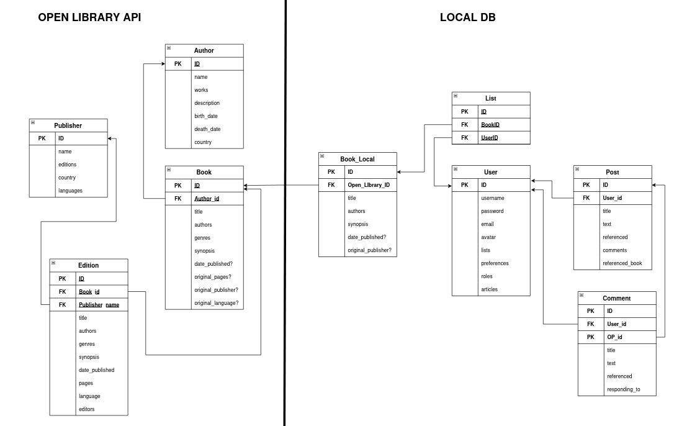
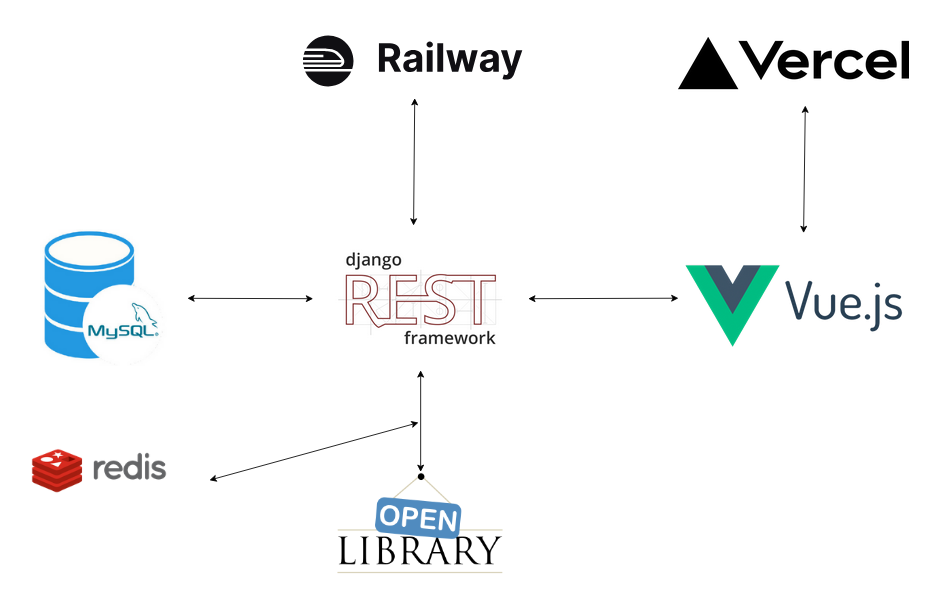

# NEWREADS: PROYECTO FINAL 

+ Autor: Jaime León García
+ Curso: 2024/2025 2º DAW
+ Tutor: David Jorge Bilbao

## Índice

1. [**INTRODUCCIÓN.**](#id1)
2. [**ESTRUCTURA FINAL.**](#id2)
3. [**TECNOLOGÍAS UTILIZADAS.**](#id3)
4. [**DERECHOS DE AUTOR.**](#id4)
5. [**GRADO DE CUMPLIMIENTO.**](#id5)
6. [**PLAN DE MARKETING.**](#id6)
7. [**PLAN DE MANTENIMIENTO.**](#id7)

## 1. INTRODUCCIÓN. 

Este documento presenta el reporte de la primera fase de desarrollo de NewReads, aquí se verán datos como la estructura final, las tecnologías utilizadas durante el desarrollo, el rango de cumplimiento con los objetivos acordados y las medidas a tomar, los planes de expansión a futuro, el plan de marketing y el de mantenimiento.

## 2. ESTRUCTURA FINAL

## 3. TECNOLOGÍAS UTILIZADAS. 

### BACKEND

**Django==5.2:** Framework web depara Python que permite construir APIs y aplicaciones robustas rápidamente.

**djangorestframework==3.16.0:** Extensión de Django para construir APIs RESTful de forma sencilla y estructurada.

**mysql-connector-python==8.3.0:** Conector para integrar Django con MySQL, una base de datos relacional usada para almacenar información estructurada.

**djangorestframework_simplejwt==5.5.0:** Librería para autenticación basada en tokens JWT, que permite login seguro y sin sesiones.

**django-cors-headers==4.7.0:** Middleware para permitir solicitudes entre diferentes dominios (CORS), útil al conectar frontend y backend.

**gunicorn==23.0.0:** Servidor WSGI ligero para ejecutar aplicaciones Django en producción de forma eficiente.

### Frontend

**Vue 3 + vue-router:** Framework progresivo de JavaScript usado para construir interfaces de usuario interactivas. Vue Router gestiona la navegación de páginas de forma dinámica sin recargar el navegador.

**Axios:** Cliente HTTP que permite integrar aplicaciones con APIs para enviar y recibir datos.

**Pinia:** Sistema de gestión de estado para Vue 3, útil para compartir datos entre componentes.

**Herramientas de estilo:** Tailwind CSS Framework, Toastification, Vue-Spinner

### Despliegue

**Railway:** Plataforma de backend como servicio (BaaS) utilizada para desplegar y escalar la API de Django junto con la base de datos MySQL.

**Vercel:** Plataforma de frontend como servicio (FaaS) para desplegar aplicaciones Vue.js de forma rápida y optimizada.

**Nginx:** Servidor web y proxy inverso usado para servir archivos estáticos y reenviar solicitudes al backend, mejorando rendimiento y seguridad.

## 4. DERECHOS DE AUTOR. 

Todas las tecnologías y plugins utilizadas en este proyecto son de codigo abierto, la mayoría con licencias MIT, excepto los servidores de producción Railway y Vercel.

Hay que recordar que la aplicación hace uso de Open Library API, la cual es de código abierto, usa libros ambos de dominio público y privado, por lo cual hay que tomar ciertas consideraciones como atribuir abiertamente a Open Library por el uso de sus servicios y no distribuir contenido completo de libros que no estén claramente en dominio público.

## 5. GRADO DE CUMPLIMIENTO. 

Se ha implementado todo lo acordado entre el equipo y el supuesto cliente a excepción de que en el frontend no se ha usado la tecnología acordada debido a la falta de tiempo pero ello no ha impedido que el producto final se vea apropiadamente.

Se han conseguido implementar las funciones que componen el producto mínimo viable con excepciones.

El producto final ha resultado limitado desde el punto de vista de estilo y funcionalidades puntuales como el guardado de listas y fotos de perfil.

Entre las funcionalidades acordadas que han sido implementadas destacan:

- Pagina Inicial con ejemplos de las funcionalidades
- Login y registro con uso de token
- Zona de usuario con su información, listas y posts
- Zona de busqueda de libros, posts, listas y usuarios
- Sistema de guardado de listas ajenas
- Sistema de Foro
- Sistema de creación y administración de listas
- Zona de Administrador
- API

Funcionalidades más urgentes a añadir

- Sistema de moderación complejo con feed y bloqueo de cuenta
- Implementación de mejoras en la edición de usuario
- Estilos y efectos para elever el frontend

## 6. PLAN DE MARKETING Y FUTURO. 

Creemos que la evolución natural de una página como esta yace en el componente social y de compartición, esto implica convertirla en una red social para lectores, añadiendo funcionalidades como seguimiento, feed personalizada, grupos, clubs de lectura con libros designados por el administrador, etc.

Siguiendo este camino, las principales formas de monetización viables para la app serían:

- **Publicidad:** Un sistema de publicidad poco invasivo localizado principalmente en los laterales de la página, bajo la barra de navegación o en los resultados de búsqueda.

- **Afiliación con librerías virtuales:** Contratar afiliaciones con librerías como Amazon, Book Depository, etc. Añadiendo un sistema de links a las páginas de estos a cambio de una comisión por compra a través de estos.

## 7. COSTE DE MANTENIMIENTO. 

- **Railway para despliegue DRF + MySQL + Redis:** Para este componente se ha deicdido utlilizar el plan Starter de pago para garantizar ejecución continua y rendimiento adecuado con posibilidad de escalar. Inicialmente este servicio costará 5 euros mensuales, pero podría escalar hasta 15 dependiendo de las necesidades de la aplcación

- **Vercel para desplegue de frontend Vue 3:** Para esta aplicación se ha decidido continuar con el plan gratuito de Vercel hasta que surja la necesidad de ampliar a la versión de pago de 20€ mensuales. Ya que el plan gratuito es suficiente para el tráfico que verá la aplicación en su estado actual.

- **Dominio personalizado:** Se plantea registrar un dominio propio con un proveedor externo como Google Domains o GoDaddy, los cuales rondan un coste anual de 10 a 20 euros anuales.

| Servicio             | Plan usado       | Coste mínimo (EUR/mes)   | Coste máximo (EUR/mes)   |
|----------------------|------------------|--------------------------|--------------------------|
| Railway (backend)    | Starter (pago)   | 5.00€                    | 15.00€                   |
| Vercel (frontend)    | Gratuito         | 0.00€                    | 20.00€                   |
| Dominio personalizado| Registro externo | 1.00€                    | 2.00€                    |
| **Total estimado**   | —                | **6.00€**                | **27.00€**               |
